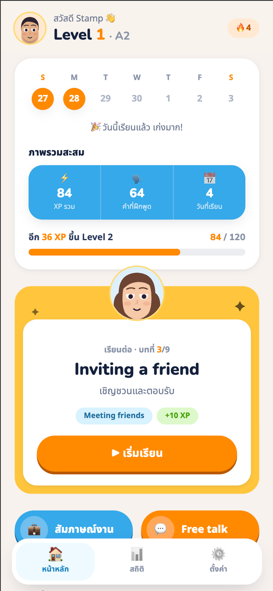
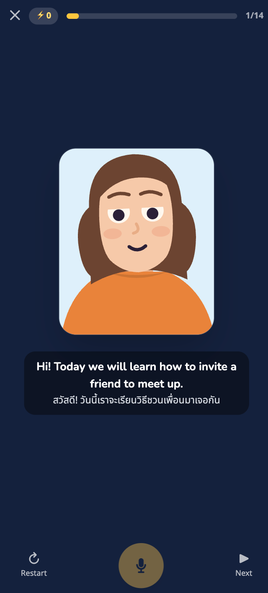
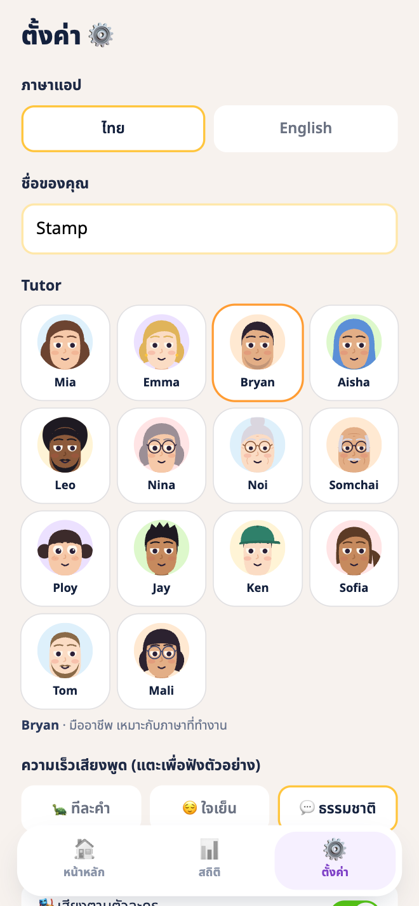

# AI Tutor

A speaking-practice app for Thai learners of English — spoken drills, scripted role-play,
and open conversation with an AI tutor, wrapped as an installable PWA.

**Status: work in progress.** The lesson drills, role-play, free talk, TTS stack and progress
tracking all run; content is one A2 course and the polish is unfinished. I'm building it in
the open rather than waiting until it's done.

> Thai-language setup and usage guide: [`app/README.md`](app/README.md)

| | | |
|:--:|:--:|:--:|
|  |  |  |
| Progress, XP and streak | Speaking drill, bilingual subtitles | Fourteen tutors, each with a voice |

---

## Why this repo is worth a look

The interesting part isn't the app, it's the constraints. It had to run on **free tiers and
local models**, stay usable when a network call fails, and still feel fast. Most of the design
decisions below fall out of that.

### 1. A six-model fallback chain, ordered by latency — not by capability

```ts
const MODEL_CANDIDATES = [
  'gemini-flash-lite-latest',
  'gemini-flash-latest',
  'gemini-3.5-flash',
  'gemini-3-flash-preview',
  'gemini-2.5-flash',
  'gemini-2.0-flash',
]
```

`flash-lite` goes first deliberately: it skips the "think before answering" delay, and for
conversational language practice it is more than smart enough. A slower, smarter model would
make the tutor feel broken.

Two failure modes this also handles:

- **Model deprecation.** Fresh API keys get `404 "no longer available to new users"` on older
  models. The `*-latest` aliases survive Google retiring a version, so they sit near the top.
- **Re-probing cost.** Once a model answers successfully it's cached in `localStorage`, so the
  chain isn't walked again on every session.

### 2. Knowing when *not* to call the model

Two features that look like obvious LLM work are deliberately deterministic:

| Feature | Implementation | Why |
|---|---|---|
| Checking a spoken drill answer | `services/matcher.ts` — local fuzzy match against the target sentence, with contraction normalisation (`don't` → `do not`) | Runs offline, costs nothing, and is never wrong about whether two sentences match |
| Pronunciation tips | `services/pron-rules.ts` — hand-written rules targeting mistakes Thai speakers actually make | Small models invent plausible-sounding pronunciation advice. Rules are boring and correct |

Reaching for the LLM everywhere is the expensive mistake. These two paths are the hot path of
the app, and neither needs it.

### 3. Three tiers of speech, degrading gracefully

```
system speechSynthesis  →  Kokoro 82M in a Web Worker  →  Gemini TTS (cloud)
```

The local tier loads a ~90MB model once, caches it in the browser, generates in a **Web Worker**
so the UI never blocks, and stores rendered audio in **IndexedDB** so a repeated sentence plays
instantly. The cloud tier is rate-limited, so uncached requests that would fail are queued
quietly for next time instead of erroring in the user's face.

### 4. Cloud or local brain, same interface

`services/gemini.ts` (cloud) and `services/ollama.ts` (local, `localhost:11434`) are
interchangeable behind one chat interface. Ollama errors are typed —
`unreachable | no-model | other` — so the UI can tell the user *which* thing to fix rather than
showing a generic failure.

### 5. Trading a 3D avatar for fourteen drawn ones

The tutor started as a rigged **VRM model rendered with three.js**. It cost ~11MB of binary
asset, pulled in a 3D runtime, tied the app to someone else's character licence, and gave me
exactly one tutor.

It was replaced with `components/FlatTutor.tsx` — an animated flat-SVG character assembled from
parametric parts (hair, skin, eyes, brows, accessories). The same 180 lines render a cast of
**fourteen** distinct tutors, each of which can carry its own voice (`voicePerCharacter` in
Settings, wired through a global speaker state). three.js and the binary assets are gone, every
character is original artwork, and adding another is a data change rather than a modelling job.

---

## Stack

React · TypeScript · Vite · TailwindCSS · PWA
Gemini API · Ollama · Kokoro TTS (`kokoro-js`) · Web Speech API
Animated SVG characters · Thai/English i18n (`services/i18n.ts`)

## Layout

```
app/src/
├── screens/     Onboarding · Home · LessonPlayer · ScenePlayer · FreeTalk · LessonComplete · Progress · Settings
├── services/
│   ├── gemini.ts / ollama.ts        cloud + local chat
│   ├── gemini-tts.ts / local-tts.ts / kokoro-worker.ts / tts.ts / audio-bus.ts
│   ├── matcher.ts / pron-rules.ts   deterministic answer checking + pronunciation tips
│   └── store.ts                     settings, progress, streak (localStorage)
├── components/  FlatTutor (parametric SVG cast), ExerciseCard, ChatBubble, MicButton, RetryCoach
└── content/     course-a2.json — 3 modules × 3 lessons + 4 scenes, JSON-authored
```

## Running it

```bash
cd app
npm install
npm run dev
```

Chrome or Safari (the app uses the Web Speech API). Drills and local TTS work with no
configuration. Role-play and free talk need a free Gemini key, entered in Settings and kept in
`localStorage` — there is no server and no key in this repo.

## Known gaps

- One A2 course only; the content pipeline supports more, the content doesn't exist yet
- No tests
- Not deployed anywhere public yet

## Characters

All fourteen tutors are original flat-vector artwork generated from parametric SVG parts —
no third-party character assets are bundled, and nothing needs downloading at runtime.
Approved prototypes live in `design/`.

## Credits

Full attribution and third-party terms: [`CREDITS.md`](CREDITS.md).
Inspired by BeeSpeaker. Offline speech from [Kokoro](https://github.com/hexgrad/kokoro) (82M).
